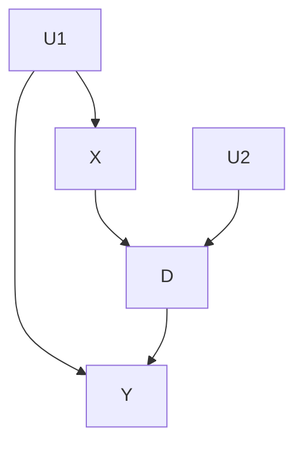

# Linear Programming for Interventional Queries
## Input
### Graph input
The graph must be specified in a .txt file with the following structure:
```shell
Number of nodes
Number of edges
Node_0 cradinalitie_0 # declaration of all nodes and their cardinalities
Node_1 cardinalitie_0
...
Node_n cardinalitie_n
Node_X Node_Y # declaration of the edges(Node_X -> Node_Y)
...
NodeS_U Node_V
```
For instance, the graph:

Should be translated into the input:
```shell
5
6
U1 0
U2 0
X 2
D 2
Y 2
X Y
X D
U1 Y
U1 X
D Y
U2 D
```
Note that **latent nodes must have 0 as their cardinality**. Also note that every exogenous node must be latent and all endogenous node must have a latent parent, even if it's not a confounder.7
### Data Input
Data should be provided whithin a .csv file with the collumns labelled with the same name as the graph nodes.
Notice that not necessarily all endogenous nodes data is required for a specific intervention query.
## Method
The program transforms an interventional query into a linear optimization problem. In order for this to be possible, we require that:
- The graph is markovian or quasi-markovian. In other words, no endogenous node has more than one latent parent
- The query contains a single intervention variable

### Objective Function
We use an algorithm developed in the laboratory. Starting with a set containing only the intervention target node, it proceeds with one of the following cases:
1) If the current target node is independent from the intervention, just remove the node from the set.
2) If the current target node is a children of the latent parent of the intervention, add all of its parents to the set.
3) If the current target node is not independent from the intervention and is not a children of the latent parent of the intervention, find a subset of variables such that, when conditioned on: the current target is independent from the latent parent of the intervention and the current target is independent of the intervention in the graph in which the outgoing edges of the intervention are croped.

By processing in reverse topological order, we guarantee (with proof) that exactly one of the 3 cases is possible in each iteration and that no variable is placed more than one time on the set. As the graph is finite, this guarantees that the process ends.

Using the variables that where in the set at least for one iteration, we can always write a linear objective function. 
### Constraints
We use the linear factorization as provided by [Zaffalon et. al.](https://arxiv.org/abs/2109.13471). Which can be expressed as:
$` p(\textbf{V}) = \sum_{u \mapsto \textbf{V}} P(U = u) `$. The left side is a product of conditional probablities, whitch is known from the data, and the right side is the sum of the probabilities of the latent variable $U$, whitch are our optimization variables, to assume a value compatible with the distribuition of the nodes in **V**. 

## Good Software Practices

<a name="flake8"></a>
### Flake8 
**Flake8** is a powerful tool for enforcing style guidelines. It scans your code to identify deviations from PEP 8, such as improper indentation, excessive line lengths, and unused imports. By integrating Flake8 into your development workflow, you can maintain clean and consistent code, making it easier to read and maintain.

Key Features:
- **Syntax Checking:** Detects syntax errors that could cause your code to fail.
- **Style Enforcement:** Ensures adherence to PEP 8 guidelines, promoting uniform coding practices.
- **Plugin Support:** Extensible with plugins to add more checks or customize existing ones.

Usage Example:

```shell
flake8 your_script.py
```

Running this command will output any style violations or errors found in `your_script.py`, allowing you to address them promptly.

<br>


<a name="black"></a>
### Black 
This project uses **[Black](https://black.readthedocs.io/en/stable/)** for automatic Python code formatting.  
Black is an code formatter that ensures consistency by enforcing a uniform style.  

### **Installation**  
To install Black, run:  
```bash
pip install black
```

Usage Example:

```shell
black your_script.py
```

Running this command will change automatically.

<br>

### Imports

#### Isort
**isort** focuses specifically on the organization of import statements. It automatically sorts imports alphabetically and separates them into sections (standard library, third-party, and local imports), ensuring that your import statements are both orderly and compliant with best practices. This not only enhances readability but also helps prevent merge conflicts and import-related errors.

Key Features:
- **Automatic Sorting:** Organizes imports alphabetically and by category.
- **Customization:** Allows configuration to match specific project requirements.

Usage Example:

isort is very easy to use. You can sort the imports in a Python file by running the following command in your terminal:

```shell
isort your_script.py
```

Or for all files:
```shell
isort .
```

After running the command, save the file to apply the sorted imports.

**Example of isort in Action:**

_Before isort:_
```python
import os
import sys
import requests
from mymodule import myfunction
import numpy as np
```

_After isort:_

```python
import os
import sys

import numpy as np
import requests

from mymodule import myfunction
```

In this example, isort has organized the imports into three distinct sections:
- **Standard Library Imports:** os, sys
- **Third-Party Imports:** numpy, requests
- **Local Application Imports:** mymodule

This separation improves readability and maintainability of your code by clearly distinguishing between different types of dependencies.

## Install
### Linux
We're using [poetry](https://python-poetry.org/docs/) as pyhton dependency management.

- Activate poetry virtual environment
```bash
poetry shell
```
- Install dependencies
```bash
poetry install
```

## How to run
### Linux
- Activate poetry virtual environment
```bash
eval $(poetry env activate)
```


Example:
```bash
python3 causal_reasoning/example/scipy_example.py
```
The output should be:
```
Using the complete objective function, the results are:
Lower bound: -0.23 - Upper bound: -0.15

Using the complete objective function, the result for the positive query is:
Lower bound: 0.45 - Upper bound: 0.52
Using the complete objective function, the result for the negative query is:
Lower bound: 0.67 - Upper bound: 0.68

With the first method, we obtain the interval: [-0.23,-0.15]
With the second method, we obtain the interval: [-0.23,-0.15]
```

- To exit the poetry virtual environment run:

```bash
exit
```
or

```bash
deactivate
```

