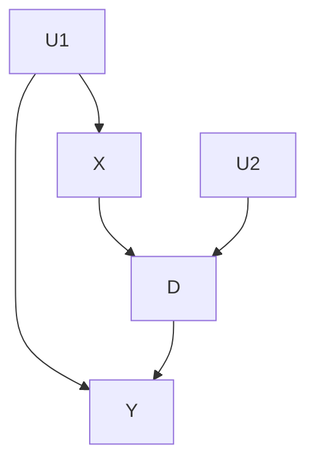

# Linear Algorithm
## Input
### Graph input
The graph must be specified in a .txt file with the following structure:
```shell
Number of nodes
Number of edges
Node_0 cradinalitie_0 # declatrion of all nodes and their cardinalities
Node_1 cardinalitie_0
...
Node_n cardinalitie_n
Node_X Node_Y # declaration of the edges(Node_X -> Node_Y)
...
Nod_U Node_V
```
For instance, the graph:

Should be translated into the input:
```shell
5
6
U1 0
U2 0
X 2
D 2
Y 2
X Y
X D
U1 Y
U1 X
D Y
U2 D
```
Note that latent nodes must have 0 as their cardinality. Also note that every exogenous node must be latent and all endogenous node must have a latent parent, even if it's not a confounder.
### Data Input
Data should be provided whithin a .csv file with the collumns labelled with the same name as the graph nodes
## Method
