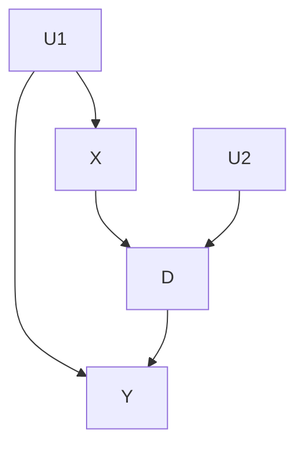

# Linear Algorithm
## Input
### Graph input
The graph must be specified in a .txt file with the following structure:
```shell
Number of nodes
Number of edges
Node_0 cradinalitie_0 # declaration of all nodes and their cardinalities
Node_1 cardinalitie_0
...
Node_n cardinalitie_n
Node_X Node_Y # declaration of the edges(Node_X -> Node_Y)
...
NodeS_U Node_V
```
For instance, the graph:

Should be translated into the input:
```shell
5
6
U1 0
U2 0
X 2
D 2
Y 2
X Y
X D
U1 Y
U1 X
D Y
U2 D
```
Note that **latent nodes must have 0 as their cardinality**. Also note that every exogenous node must be latent and all endogenous node must have a latent parent, even if it's not a confounder.7
### Data Input
Data should be provided whithin a .csv file with the collumns labelled with the same name as the graph nodes.
Notice that not necessarily all endogenous nodes data is required for a specific intervention query.
## Method
The program transforms an interventional query into a linear optimization problem. In order for this to be possible, we require that:
- The graph is markovian or quasi-markovian. In other words, no endogenous node has more than one latent parent
- The query contains a single intervention variable
### Inputs:
- Graph: encoded in the way that was described above and stored in a .txt file.
- Data: a .csv file containing the results of experiments for the endogenous nodes.
### Objective Function
We use an algorithm developed in the laboratory. Starting with a set containing only the intervention target node, it proceeds with one of the following cases:
1) If the current target node is independent from the intervention, just remove the node from the set.
2) If the current target node is a children of the latent parent of the intervention, add all of its parents to the set.
3) If the current target node is not independent from the intervention and is not a children of the latent parent of the intervention, find a subset of variables such that, when conditioned on: the current target is independent from the latent parent of the intervention and the current target is independent of the intervention in the graph in which the outgoing edges of the intervention are croped.

By processing in reverse topological order, we guarantee (with proof) that exactly one of the 3 cases is possible in each iteration and that no variable is placed more than one time on the set. As the graph is finite, this guarantees that the process ends.

Using the variables that where in the set at least for one iteration, we can always write a linear objective function. 
### Constraints
We use the linear factorization as provided by [Zaffalon et. al.](https://arxiv.org/abs/2109.13471). Which can be expressed as:
$` p(\textbf{V}) = \sum_{u \mapsto \textbf{V}} P(U = u) `$. The left side is a product of conditional probablities, whitch is known from the data, and the right side is the sum of the probabilities of the latent variable $U$, whitch are our optimization variables, to assume a value compatible with the distribuition of the nodes in **V**. 
