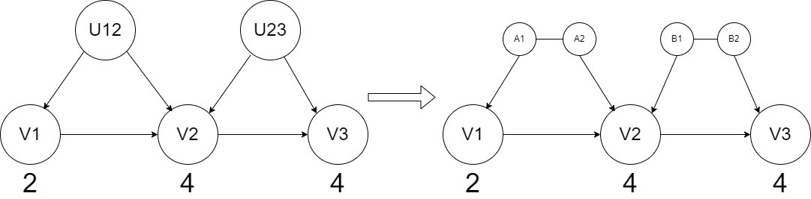

# Decomposição das variáveis latentes:

## Motivação:
Seriam obtidas cardinalidades menores caso pudéssemos dividir cada exógena em um conjunto de variáveis menores que a compõem cada latente. Isso porque, em cada c-component, teria-se um ganho em cima de cada variável endógena que possui mais de um pai exógeno.

## Ideia:
Para cada variável exógena poderia-se montar um conjunto de variáveis menores. Em particular, uma para cada filho endógeno. Desta forma, teria-se uma restrição para cada nó endógeno do grafo. Tal seria dada com base no produto das cardinalidades dos componentes de variáveis exógenas que são pais de endógena ser maior ou igual ao número de funções que mapeiam do domínio dado pelo produto cartesiano dos pais endógenos para a imagem dada pelo espaço de cada variável endógena.

## Exemplo:
Há duas variáveis latentes em um mesmo c-component, o que não pode ser resolvido de forma exata com a técnica do Zhang.

Nossa conjuctura seria que é necessário e suficiente que: A1 >= |V1|; A2 * B1 >= |V2|; B2 >= |V3|
