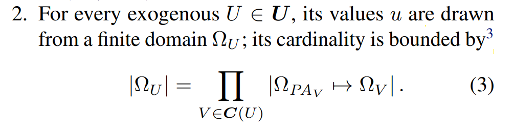
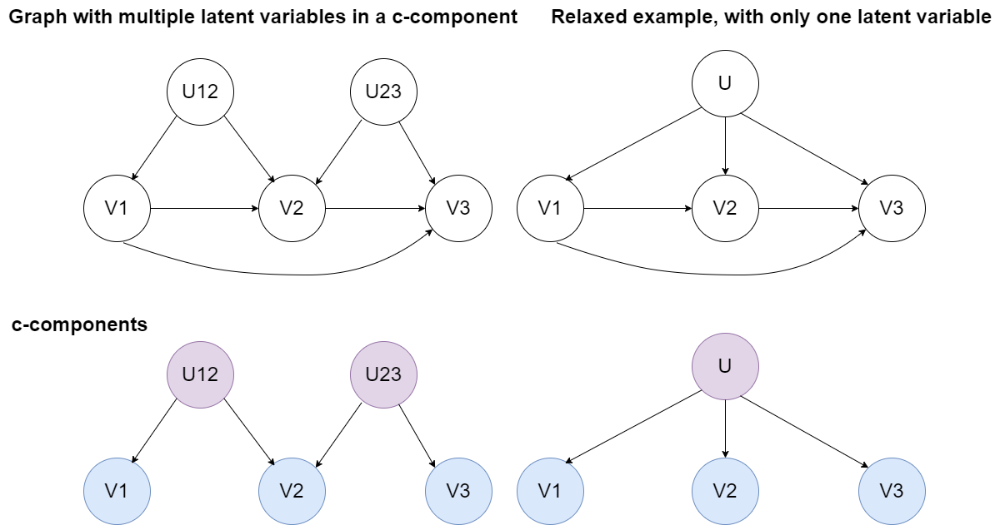

# Documentação do método usado por Zhang (2022):

## Motivação:
Resolve o problema original (i.e não remove restrições). Porém, ainda é um *upper-bound* para as cardinalidades.

## Explicação do método:
- Primeiro, determina-se cada c-component do DAG fornecido.
- Para cada c-component, o método implica que todas as latentes nele contidas terão a mesma cardinalidade. Tal cardinalidade é dada por:

É importante notar que C(Ui) = C(Uj) caso estejam em um mesmo c-component, porque C(U) trata do "c-component maximal" que engloba U (i.e seus filhos endógenos). Desse forma, nota-se que existe uma aproximação na medida em que o "pior caso" é assumido para todas as variáveis.

## Exemplo: 
No grafo abaixo, tem-se duas variáveis latentes U12 e U23 no mesmo c-component. O problema relaxado usa uma única variável latente U, que causa V1, V2 e V3.

## Resultados comparativos com o problema original via LCN
- TO DO.

## Ideias:
- Podemos usar a abordagem do Zhang para computar bounds iniciais com o LCN. Então, aplicamos uma diminuição das partições canônicas de certas latentes por um dado fator e comparamos os resultados. Como há pouca literatura sobre o assunto e a complexidade das demonstrações associadas a este problema é muito elevada, temos trabalhado majoritariamente com conjecturas até o momento. Acredito que a melhor forma de ter maior credibilidade em nossas conjecturas e remover suposições inférteis seria justamente com base nos resultados (supondo que o LCN funcione). 
- Se chutar um número maior que o de partições canônicas não implicar um bound maior (i.e que não é *sharp*) então já temos o "gabarito" apenas com a abordagem do Zhang - ou até mesmo do autobounds. Dessa forma, podemos checar se cada configuração que testamos gerou o resultado correto ou não. Na prática, entendo que poderíamos indiretamente determinar as partições canônicas de alguns exemplos com base em teste por exaustão para cardinalidades menores comparando com o gabarito do Zhang.

