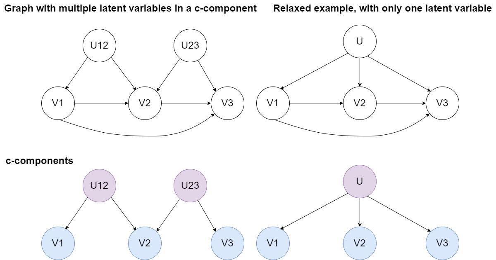

# Documentação do método relaxado de resolução:

## Motivação:
Quando um c-component (confounding component) contém múltiplas variáveis latentes, existe uma limitação no algoritmo de determinação de partições canônicas do autobounds, que resolve a questão calculando um número maior do que o necessário. O algoritmo proposto simplifica siginificativamente o processo de cálculo de partições canônicas ao resolver um problema com menos restrições (i.e relaxado), propondo um *trade-off* entre complexidade temporal de computação e *sharpness* do intervalo calculado para um ATE ou query intervencional.

## Explicação do método:
- Primeiro, determina-se cada c-component do DAG fornecido.
- Para cada c-component, considera-se um problema menos restrito, no qual há apenas uma variável latente que se conecta a todas as variáveis observáveis do componente. Assim, pode-se calcular o valor exato das partições no grafo simplificado.
- *Queries* causais devem ser respondidas usando o número de partições calculado acima e o DAG modificado, no qual todas as latentes de um c-component são trocadas por uma única, que se conecta a todos as variáveis observáveis. 

## Exemplo: 
No grafo abaixo, tem-se duas variáveis latentes U12 e U23 no mesmo c-component. O problema relaxado usa uma única variável latente U, que causa V1, V2 e V3.

## Resultados comparativos com o problema original via LCN
- TO DO.

## Questões:
- O intervalo obtido é quão maior no problema relaxado em relação ao original? Como é um problema muito difícil para resolver analiticamente uma ideia seria usar o LCN para medir essa discrepância.
- Usar um número de partições maior que o canônico apenas aumenta o tempo de computação? Ou também pode implicar em um *bound* que não é *sharp*.
